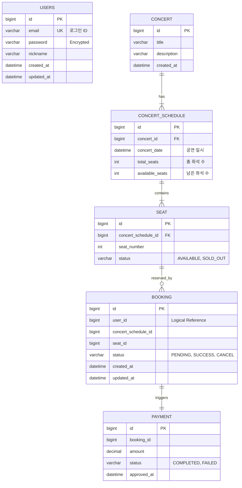

# Database Schema & Data Strategy

이 문서는 **콘서트 티켓팅 서비스**의 데이터 지속성(Persistence)을 담당하는 **MySQL(RDBMS)**과 **Redis(In-Memory)**의 스키마 및 키 전략을 정의한다.

---

## 1. RDBMS Schema (MySQL 8.0)

모든 테이블 이름은 `snake_case`를 사용하며, PK는 `BIGINT (Auto Increment)`를 기본으로 한다.
논리적으로 도메인이 분리되어 있으므로, **User 테이블과 Booking 테이블 간의 물리적 FK 제약조건(Foreign Key Constraint)은 설정하지 않는다.** (느슨한 결합)

### 1.1 ER Diagram (Mermaid)



### 1.2 Table Specifications & Constraints

#### A. `users` (회원)

- **Role:** 사용자 인증 및 프로필 정보.
- **Constraints:** `email`은 유니크 인덱스(`UK_users_email`) 필수.

#### B. `seat` (좌석 - Inventory)

- **Role:** 공연 회차별 물리적 좌석 정보.
- **Concurrency Strategy:**
    - **Primary Lock:** Redis `SETNX seat:{scheduleId}:{seatId}`로 원자적 선점 제어.
    - **DB 역할:** 영구 저장 및 상태 관리 (Redis 선점 성공 후 업데이트).
    - **Final Barrier:** `booking` 테이블의 Unique Constraint가 최종 방어선 역할.
- **Index:** `idx_schedule_status` (`concert_schedule_id`, `status`) - 스케줄별 잔여 좌석 조회 최적화.

#### C. `booking` (예매 - Order)

- **Role:** 좌석 선점 및 결제 상태를 관리하는 핵심 트랜잭션 테이블.
- **Concurrency Control (Critical):**
    - **최종 방어선(Final Barrier):** Redis `SETNX` 이후 DB 레벨 중복 방지.
    - **Unique Constraint:** `UK_booking_seat_schedule` (`seat_id`, `concert_schedule_id`)
    - **보장사항:** 특정 회차의 특정 좌석에 대해 단 하나의 활성 Booking만 존재 가능.
    - **효과:** Redis 장애/Eviction 등 예외 상황에서도 DB가 데이터 정합성 보장.
- **Index:** `idx_user_status` (`user_id`, `status`) - 사용자별 예약 내역 조회 최적화.

-----

## 2\. Redis Schema (Hybrid Queue & Lock)

대기열과 동시성 제어를 위해 Redis를 적극 활용하며, 목적에 따라 자료구조를 엄격히 구분한다.

### 2.1 Queue Domain (The Hybrid Approach)

| Key Pattern | 자료구조 | TTL | 설명 |
|:---|:---:|:---:|:---|
| **`queue:wait:{scheduleId}`** | **ZSet** | N/A | **스케줄별 대기열 (Waiting)**<br>- Member: `userId`<br>- Score: `Timestamp` (진입 시각)<br>- *용도:* 스케줄별 대기열 분리로 성능 향상 및 동시성 제어 |
| **`queue:active:{scheduleId}`** | **ZSet** | N/A | **스케줄별 활성열 (Active Management)**<br>- Member: `userId`<br>- Score: `ExpireTimestamp` (만료 시각)<br>- *용도:* 인원 수 제한(`ZCARD`) 및 만료 청소(`ZREMRANGE...`) |
| **`active:token:{userId}`** | **Hash** | 5\~10분 | **접근 토큰 (Validation)**<br>- `token`: UUID<br>- `status`: "ACTIVE"<br>- `concert_schedule_id`: 진입한 스케줄 ID<br>- `extend_count`: 연장 횟수 (0\~2)<br>- *용도:* API 검증 및 메타데이터 관리 (CPU 효율) |

### 2.2 Booking Domain (Concurrency Control)

| Key Pattern | 자료구조 | TTL | 설명 |
|:---|:---:|:---:|:---|
| **`seat:{scheduleId}:{seatId}`** | **String** | 5분 | **좌석 선점 (Pre-occupation)**<br>- Value: `userId`<br>- **Command:** `SET ... NX EX 300`<br>- *용도:* DB 부하를 막기 위한 1차 Fail-Fast 방어막 |

-----

## 3. Data Flow & Consistency Rules

### 3.1 Seat Reservation Flow (좌석 선점)

#### Phase 1: Redis 원자적 선점 (1차 방어 - Fail-Fast)
```redis
SETNX seat:{scheduleId}:{seatId} {userId} EX 300
```
- **성공:** 해당 사용자가 좌석 선점 → Phase 2 진행 (1명만 통과)
- **실패:** 이미 선점된 좌석 → **즉시 에러 반환** (DB 접근 차단, 대규모 트래픽 보호)

#### Phase 2: DB 영구 저장 (트랜잭션 처리)
```sql
BEGIN TRANSACTION;

-- 1. 예약 기록 생성
INSERT INTO booking (user_id, concert_schedule_id, seat_id, status)
VALUES ({userId}, {scheduleId}, {seatId}, 'PENDING');

-- 2. 좌석 상태 업데이트
UPDATE seat
SET status = 'SOLD_OUT'
WHERE id = {seatId}
  AND concert_schedule_id = {scheduleId}
  AND status = 'AVAILABLE';

COMMIT;
```
- **Unique Constraint 방어:** Redis 장애 시에도 `UK_booking_seat_schedule`이 중복 방지.
- **Version 불필요:** Redis 선점으로 이미 동시성 제어 완료, DB는 순수 저장 역할.

### 3.2 Cleanup Strategy (Data Consistency)

#### 결제 실패/취소 시 보상 트랜잭션 (Compensating Transaction)
```sql
BEGIN TRANSACTION;

-- 1. DB 상태 업데이트
UPDATE booking SET status = 'CANCEL' WHERE id = {bookingId};
UPDATE seat SET status = 'AVAILABLE' WHERE id = {seatId};

COMMIT;
```
```redis
-- 2. Redis Lock 해제 (순서 중요: DB 커밋 후 삭제)
DEL seat:{scheduleId}:{seatId}
```
- **실행 순서:** DB 커밋 → Redis 삭제 (역순 시 동시성 이슈 발생 가능)
- **효과:** 즉시 다른 사용자가 해당 좌석 선점 가능하도록 복구.

#### Redis TTL 자동 만료 (5분)
- 결제 미완료 시 Redis 키 자동 삭제 → 좌석 자동 해제.
- **DB 정리:** 스케줄러가 `PENDING` 상태 5분 초과 건 `CANCEL` 처리.

