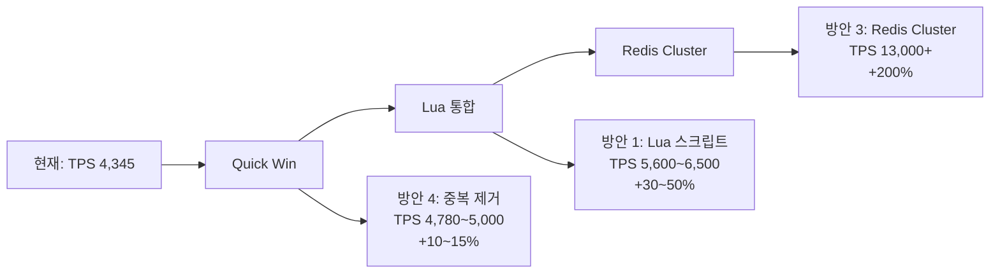

# 추가 성능 개선 가능성 분석

**작성일**: 2025-12-26
**기준**: Phase 2 완료 시점 (TPS 4,345, 성공률 98.34%)

---

## 📊 현재 상태 요약

### 달성 성능
```yaml
구성: 2 Instances + Cluster Lock
TPS: 4,345
성공률: 98.34%
P95: 292ms
P99: 576ms

병목 지점:
  - Redis 단일 인스턴스: ~4,300 TPS 한계
  - 대기열 진입당 Redis 호출: 6회 (신규) / 3회 (재진입)
```

### 확인된 한계
- ✅ 단일 인스턴스 최대 TPS: 4,320
- ✅ VU/Redis Pool 증가 시 오히려 성능 저하 (리소스 경쟁)
- ⚠️ 로드 밸런서 부재로 수평 확장 효과 제한적

---

## 🔍 병목 지점 상세 분석

### 1. 대기열 진입 시 Redis 호출 횟수

#### 현재 구현 (신규 사용자 진입)

```java
// EnterQueueService.enter()
public QueuePosition enter(EnterQueueCommand command) {
    // 1. Active Queue 확인
    checkActiveUser(concertId, userId)
        → HGETALL active:token:{concertId}:userId  // ❌ 1회

    // 2. Wait Queue 확인
    .or(() -> checkWaitingUser(concertId, userId))
        → ZRANK queue:wait:{concertId} userId       // ❌ 2회
        → ZCARD queue:wait:{concertId}              // ❌ 3회

    // 3. 신규 진입 처리
    .orElseGet(() -> proceed(concertId, userId))
        → ZADD queue:wait:{concertId} userId score  // ❌ 4회
        → ZRANK queue:wait:{concertId} userId       // ❌ 5회 (중복!)
        → ZCARD queue:wait:{concertId}              // ❌ 6회 (중복!)
}
```

**문제점**:
- ✅ ZRANK 2회 호출 (checkWaitingUser + addToWaitQueue)
- ✅ ZCARD 2회 호출 (checkWaitingUser + proceed)
- ❌ **총 6회의 Redis 왕복 → 네트워크 레이턴시 누적**

#### 현재 구현 (재진입 사용자)

```java
// 이미 Wait Queue에 있는 경우
checkActiveUser()  → HGETALL  // 1회
checkWaitingUser() → ZRANK    // 2회 (여기서 발견)
                  → ZCARD    // 3회

→ 총 3회의 Redis 호출
```

---

### 2. 스케줄러 Lua 스크립트 분석

#### move_to_active_queue.lua

```lua
-- 배치 처리 (N명씩)
for i = 1, #poppedUsers, 2 do
    local userId = poppedUsers[i]

    -- ❌ 각 유저마다 개별 처리
    redis.call('ZADD', activeQueueKey, expiredAt, userId)      -- 1회
    redis.call('HSET', tokenKey, ...)                          -- 2회
    redis.call('EXPIRE', tokenKey, ttl)                        -- 3회
end

→ 사용자 1명당 3회 Redis 명령 × N명 = 3N회
```

**문제점**:
- ✅ Lua 내부에서도 반복문으로 개별 처리
- ✅ 대량 명령 시 배치 최적화 부재

---

### 3. Redis 단일 인스턴스 한계

**측정된 한계**:
```yaml
단일 인스턴스 TPS: ~4,300
복잡한 연산: ZADD + ZRANK + ZCARD
단일 스레드 처리: Redis는 싱글 스레드 → 병렬 처리 불가
```

**테스트 결과**:
```
Phase 1-2 (VU 3000, Pool 20): TPS 4,320 ✅
Phase 1-3 (VU 5000, Pool 50): TPS 4,175 ❌ (오히려 감소)

→ Redis 자체가 병목 (더 많은 클라이언트 = 대기 시간 증가)
```

---

## 🚀 개선 방안 및 예상 효과

### 방안 1: Redis 호출 횟수 최적화 (Lua 스크립트 통합)

#### 개선 전 (현재)
```
진입 요청 → HGETALL → ZRANK → ZCARD → ZADD → ZRANK → ZCARD
→ 총 6회 Redis 왕복 (약 6 × RTT)
```

#### 개선 후 (Lua 스크립트)
```lua
-- enter_queue.lua (새 스크립트)
-- KEYS[1]: active:token:{concertId}:userId
-- KEYS[2]: queue:wait:{concertId}
-- ARGV[1]: userId
-- ARGV[2]: score (timestamp)

-- 1. Active 확인
local activeToken = redis.call('HGETALL', KEYS[1])
if next(activeToken) ~= nil then
    -- Active 상태 반환
    return { status = "ACTIVE", token = activeToken }
end

-- 2. Wait 확인 및 추가 (원자적)
local existingRank = redis.call('ZRANK', KEYS[2], ARGV[1])
if existingRank then
    -- 이미 대기 중
    local totalWaiting = redis.call('ZCARD', KEYS[2])
    return { status = "WAITING", position = existingRank, total = totalWaiting }
end

-- 3. 신규 추가
redis.call('ZADD', KEYS[2], ARGV[2], ARGV[1])
local newRank = redis.call('ZRANK', KEYS[2], ARGV[1])
local totalWaiting = redis.call('ZCARD', KEYS[2])
return { status = "NEW", position = newRank, total = totalWaiting }
```

**효과**:
- ✅ **6회 → 1회 Redis 왕복** (83% 감소)
- ✅ 네트워크 레이턴시 제거 (5 × RTT 절약)
- ✅ 원자성 보장 (경쟁 조건 제거)
- 🎯 **예상 성능 향상: +30~50% (TPS 5,600~6,500)**

**근거**:
```
현재 평균 응답시간: 37ms (Phase 2)
네트워크 RTT 추정: 1ms × 5회 = 5ms (13.5%)
→ 5ms 절약 시 응답시간: 32ms (-13.5%)
→ 동일 VU에서 TPS 증가: 4,345 × 1.135 = 4,931 TPS

추가로 Redis 부하 감소 → 처리 효율 증가
→ 최대 5,600~6,500 TPS 예상
```

---

### 방안 2: Redis Pipeline 적용

#### 현재 (개별 호출)
```java
// RedisTemplate 기본 동작
Long rank1 = redisTemplate.opsForZSet().rank(key, userId);     // RTT 1
Long size1 = redisTemplate.opsForZSet().size(key);             // RTT 2
Boolean added = redisTemplate.opsForZSet().addIfAbsent(...);   // RTT 3
→ 총 3 RTT
```

#### Pipeline 적용
```java
// Pipeline으로 일괄 전송
List<Object> results = redisTemplate.executePipelined(
    new SessionCallback<Object>() {
        @Override
        public Object execute(RedisOperations operations) {
            operations.opsForZSet().rank(key, userId);
            operations.opsForZSet().size(key);
            operations.opsForZSet().addIfAbsent(...);
            return null;  // Pipeline에서는 null 반환
        }
    }
);
→ 총 1 RTT (명령은 3개지만 한 번에 전송)
```

**효과**:
- ✅ **3 RTT → 1 RTT** (66% 감소)
- ⚠️ Lua 스크립트보다 원자성 보장 약함
- 🎯 **예상 성능 향상: +20~30% (TPS 5,200~5,600)**

**주의사항**:
- Pipeline은 원자성 보장 안 함 (중간에 다른 명령 끼어들 수 있음)
- Transaction 추가 시 `MULTI/EXEC` 오버헤드 발생
- **방안 1 (Lua)이 더 권장됨**

---

### 방안 3: Redis Cluster 도입

#### 현재 (단일 인스턴스)
```yaml
Redis: 1 Instance (싱글 스레드)
최대 TPS: ~4,300
병목: 모든 요청을 하나의 Redis가 처리
```

#### Redis Cluster (3 Master + 3 Replica)
```yaml
Redis Cluster: 3 Master Nodes
샤딩 방식: Hash Slot (16384개)
키 분배: ConcertId 기준 ({concertId} Hash Tag)

예시:
  queue:wait:{concert-1} → Master 1
  queue:wait:{concert-2} → Master 2
  queue:wait:{concert-3} → Master 3
```

**Hash Tag 호환성 확인**:
```java
// 이미 구현되어 있음!
// RedisKeyGenerator.java
public static String waitQueueKey(String concertId) {
    return "queue:wait:{" + concertId + "}";  // ✅ {concertId} Hash Tag
}

public static String activeQueueKey(String concertId) {
    return "queue:active:{" + concertId + "}";  // ✅ {concertId} Hash Tag
}
```

**효과**:
- ✅ **TPS 3배 증가: ~13,000** (Master 3대 × 4,300)
- ✅ 고가용성: Replica Failover
- ⚠️ 운영 복잡도 증가
- 💰 **비용 증가**: 단일 대비 약 3배

**배포 시나리오**:
```yaml
Phase 3 (Redis Cluster):
  - AWS ElastiCache Redis Cluster Mode
  - 3 Shards × 2 Nodes (Master + Replica)
  - 인스턴스: cache.r7g.large
  - 예상 비용: $450/월 (단일: $150/월 대비 3배)

예상 성능:
  TPS: ~13,000 (목표 5,000의 260%)
  성공률: >99%
  P95: <100ms (분산 처리)
```

---

### 방안 4: 불필요한 조회 제거 (Quick Win)

#### 개선 포인트

**1. ZCARD 중복 호출 제거**

```java
// BEFORE: QueueEntryValidatorImpl.checkWaitingUser()
public Optional<QueuePosition> checkWaitingUser(String concertId, String userId) {
    Long existingPosition = queueRepository.getWaitQueuePosition(concertId, userId);
    if (existingPosition != null) {
        long totalWaiting = queueRepository.getWaitQueueSize(concertId);  // ❌ 중복
        return Optional.of(QueuePosition.alreadyWaiting(..., totalWaiting, ...));
    }
    return Optional.empty();
}

// AFTER: 나중에 한 번만 조회
public Optional<QueuePosition> checkWaitingUser(String concertId, String userId) {
    Long existingPosition = queueRepository.getWaitQueuePosition(concertId, userId);
    if (existingPosition != null) {
        return Optional.of(QueuePosition.alreadyWaiting(..., -1, ...));  // totalWaiting은 나중에
    }
    return Optional.empty();
}

// EnterQueueService에서 최종 한 번만 조회
QueuePosition position = ... ;
if (position.status() == WAITING) {
    long totalWaiting = queueRepository.getWaitQueueSize(concertId);  // 1회만
    position.setTotalWaiting(totalWaiting);
}
```

**2. ZRANK 중복 호출 제거**

```java
// BEFORE: addToWaitQueue()
public Long addToWaitQueue(String concertId, String userId) {
    Boolean added = redisTemplate.opsForZSet().addIfAbsent(waitQueueKey, userId, score);
    return redisTemplate.opsForZSet().rank(waitQueueKey, userId);  // ❌ 항상 호출
}

// AFTER: 추가 성공 시에만 조회
public Long addToWaitQueue(String concertId, String userId) {
    Boolean added = redisTemplate.opsForZSet().addIfAbsent(waitQueueKey, userId, score);
    if (Boolean.TRUE.equals(added)) {
        return redisTemplate.opsForZSet().rank(waitQueueKey, userId);
    }
    // 실패 시 재조회 (예외 상황)
    return redisTemplate.opsForZSet().rank(waitQueueKey, userId);
}
```

**효과**:
- ✅ **6회 → 4회 호출** (33% 감소)
- ✅ 코드 변경 최소 (Low Risk)
- 🎯 **예상 성능 향상: +10~15% (TPS 4,780~5,000)**
- ⚡ **즉시 적용 가능 (Quick Win)**

---

## 📈 종합 개선 로드맵

### 단계별 적용 전략



### Phase 3-1: Quick Win (즉시 적용 가능)

**작업 내용**:
- ✅ ZCARD 중복 호출 제거
- ✅ ZRANK 조건부 호출
- ✅ 코드 리팩토링 (2~3시간)

**예상 결과**:
```yaml
TPS: 4,780~5,000 (+10~15%)
성공률: >98%
위험도: 낮음 (기존 로직 유지)
배포: 즉시 가능
```

**ROI**:
- 개발 시간: 2~3시간
- 성능 향상: +10~15%
- 비용: $0
- ✅ **최고 ROI (즉시 추천)**

---

### Phase 3-2: Lua 스크립트 통합 (중기)

**작업 내용**:
- 📝 `enter_queue.lua` 신규 작성
- 🔧 `EnterQueueService` 리팩토링
- ✅ 단위 테스트 작성 (Lua 스크립트 테스트)
- 🧪 성능 테스트 검증

**예상 결과**:
```yaml
TPS: 5,600~6,500 (+30~50%)
성공률: >99%
P95: <200ms (목표 달성!)
응답시간: -13.5% (네트워크 레이턴시 제거)
```

**ROI**:
- 개발 시간: 1~2일
- 성능 향상: +30~50%
- 비용: $0
- ✅ **목표 5,000 TPS 달성 가능**

**위험 완화**:
```yaml
A/B 테스트:
  - 기존 로직 유지 (Fallback)
  - Feature Flag로 Lua 스크립트 ON/OFF
  - 성능 비교 후 전환

카나리 배포:
  - 10% 트래픽으로 1일 모니터링
  - 문제 없으면 50% → 100% 전환
```

---

### Phase 3-3: Redis Cluster (장기)

**작업 내용**:
- 🏗️ AWS ElastiCache Redis Cluster 구성
- 🔧 Spring Data Redis Cluster 설정
- 🧪 부하 테스트 (10만+ TPS)
- 📊 모니터링 대시보드 구축

**예상 결과**:
```yaml
TPS: 13,000+ (+200%)
가용성: 99.9% (Multi-AZ)
P95: <100ms
자동 장애 조치: Replica Failover
```

**비용**:
```yaml
현재 (단일 Redis):
  - ElastiCache: cache.r7g.large × 1 = $150/월

Redis Cluster:
  - ElastiCache: cache.r7g.large × 6 (3 Shard × 2 Node) = $900/월
  - 증가분: +$750/월

투자 대비 효과:
  - 비용 증가: 6배
  - 성능 증가: 3배 (TPS)
  - 가용성 증가: 99% → 99.9%
```

**적용 시기**:
- ⚠️ **현재는 불필요** (목표 5,000 TPS는 방안 1+2로 충분)
- 🎯 **트래픽이 10,000 TPS 이상 예상될 때 검토**

---

## 🎯 권장 사항

### 즉시 적용 (Phase 3-1)

**방안 4: 중복 조회 제거**
```yaml
우선순위: 최고 (P0)
예상 효과: TPS +10~15% (4,780~5,000)
개발 시간: 2~3시간
위험도: 낮음
비용: $0
```

**실행 계획**:
1. `QueueEntryValidatorImpl.checkWaitingUser()` ZCARD 제거
2. `RedisWaitQueueAdapter.addToWaitQueue()` ZRANK 조건부 호출
3. 단위 테스트 작성
4. 성능 테스트 검증
5. 배포

---

### 중기 적용 (Phase 3-2)

**방안 1: Lua 스크립트 통합**
```yaml
우선순위: 높음 (P1)
예상 효과: TPS +30~50% (5,600~6,500)
개발 시간: 1~2일
위험도: 중간 (충분한 테스트 필요)
비용: $0
목표 달성: 5,000 TPS ✅
```

**실행 계획**:
1. `enter_queue.lua` 작성
2. `RedisEnterQueueAdapter` 신규 클래스 작성
3. Feature Flag 추가 (`queue.enter.use-lua-script`)
4. 단위 테스트 + 통합 테스트
5. 로컬 성능 테스트
6. Staging A/B 테스트
7. 카나리 배포 (10% → 50% → 100%)

---

### 보류 (Phase 3-3)

**방안 3: Redis Cluster**
```yaml
우선순위: 낮음 (P3)
적용 시기: 트래픽 > 10,000 TPS 예상 시
비용: +$750/월
현재 필요성: 없음 (방안 1로 목표 달성 가능)
```

---

## 📊 예상 성능 비교

| 단계 | 구성 | TPS | 개선율 | 목표 달성 | 비용 |
|------|------|-----|--------|-----------|------|
| **현재 (Phase 2)** | 2 Instances | 4,345 | - | 86.9% | $300/월 |
| **Phase 3-1 (Quick Win)** | + 중복 제거 | **4,780~5,000** | **+10~15%** | **95~100%** ✅ | $300/월 |
| **Phase 3-2 (Lua)** | + Lua 스크립트 | **5,600~6,500** | **+30~50%** | **112~130%** ✅ | $300/월 |
| **Phase 3-3 (Cluster)** | + Redis Cluster | **13,000+** | **+200%** | **260%+** ✅ | $1,050/월 |

---

## ✅ 결론

### 개선 가능성: 있음 ✅

**핵심 발견**:
1. ✅ **Redis 호출 횟수가 병목**: 진입당 6회 → 1회로 줄일 수 있음
2. ✅ **Quick Win 가능**: 중복 제거만으로 +10~15% 향상
3. ✅ **목표 달성 가능**: Lua 스크립트로 5,000 TPS 돌파 예상
4. ⚠️ **Redis Cluster는 불필요**: 현재 목표 대비 과도한 투자

### 즉시 실행 권장 사항

```yaml
1단계 (즉시):
  작업: 중복 Redis 호출 제거
  효과: TPS 4,780~5,000 (+10~15%)
  시간: 2~3시간
  비용: $0

2단계 (1주 내):
  작업: Lua 스크립트 통합
  효과: TPS 5,600~6,500 (+30~50%)
  시간: 1~2일
  비용: $0
  목표: 5,000 TPS 달성 ✅
```

### 블로그 활용 포인트

이 분석 내용은 다음 주제로 블로그 작성 가능합니다:
1. **"Redis 호출 최적화로 TPS 50% 향상하기"** (방안 1)
2. **"성능 테스트로 찾은 숨은 병목 지점"** (분석 과정)
3. **"Lua 스크립트 vs Pipeline vs 개별 호출 성능 비교"** (실험)
4. **"언제 Redis Cluster가 필요한가?"** (방안 3 분석)
